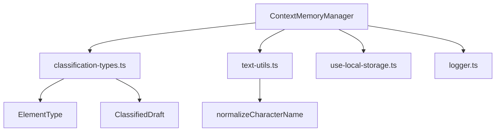

# Comprehensive Test Plan: ContextMemoryManager

## Overview

**Target File:** [`src/extensions/context-memory-manager.ts`](src/extensions/context-memory-manager.ts)

**Purpose:** ContextMemoryManager is a critical component that manages context memory for classification sessions. It tracks character frequencies, recent classifications, dialogue blocks, line relationships, and user corrections.

**Test File Location:** `tests/unit/extensions/context-memory-manager.test.ts`

---

## Architecture Analysis

### Dependencies



### Public API Surface

| Method                 | Purpose                            | Complexity |
| ---------------------- | ---------------------------------- | ---------- |
| `loadContext`          | Load context for a session         | Medium     |
| `saveContext`          | Save context for a session         | Medium     |
| `updateMemory`         | Update memory with classifications | High       |
| `saveToLocalStorage`   | Persist to localStorage            | Low        |
| `loadFromLocalStorage` | Load from localStorage             | Low        |
| `trackDialogueBlock`   | Track dialogue block               | Low        |
| `addLineRelation`      | Add line relationship              | Low        |
| `detectPattern`        | Detect repeated patterns           | Medium     |
| `addUserCorrection`    | Add user correction                | Low        |
| `getUserCorrections`   | Get user corrections               | Low        |
| `updateConfidence`     | Update confidence score            | Low        |
| `record`               | Record runtime entry               | Medium     |
| `replaceLast`          | Replace last entry                 | Medium     |
| `getSnapshot`          | Get read-only snapshot             | Medium     |

### Private Methods to Test Indirectly

- `isValidMemoryCharacterName` - via character tracking tests
- `detectLocalRepeatedPattern` - via `detectPattern` tests
- `ensureEnhanced` - via load/save tests
- `createDefaultMemory` - via initialization tests
- `getOrCreateRuntimeMemory` - via runtime tests
- `rebuildRuntimeAggregates` - via `replaceLast` tests

---

## Test Categories

### 1. Initialization Tests

```typescript
describe("ContextMemoryManager - Initialization", () => {
  it("should initialize with empty storage");
  it("should log initialization message");
});
```

### 2. Session Context Management

```typescript
describe("ContextMemoryManager - Session Context", () => {
  describe("loadContext", () => {
    it("should return null for non-existent session");
    it("should return cached context without localStorage access");
    it("should load from localStorage if not in cache");
    it("should return deep copy to prevent external mutation");
    it("should enhance basic ContextMemory to EnhancedContextMemory");
  });

  describe("saveContext", () => {
    it("should save to in-memory storage");
    it("should persist to localStorage");
    it("should enhance basic memory before saving");
    it("should create deep copy to prevent external mutation");
  });

  describe("updateMemory", () => {
    it("should create new memory for new session");
    it("should update existing memory");
    it("should append classifications to lastClassifications");
    it("should respect MAX_RECENT_TYPES limit of 20");
    it("should track character names from character classifications");
    it("should ignore invalid character names");
    it("should increment character dialogue count");
    it("should update lastModified timestamp");
  });
});
```

### 3. LocalStorage Integration

```typescript
describe("ContextMemoryManager - LocalStorage", () => {
  describe("saveToLocalStorage", () => {
    it("should not save if session not in storage");
    it("should save with correct key format: screenplay-memory-{sessionId}");
    it("should serialize memory to JSON");
  });

  describe("loadFromLocalStorage", () => {
    it("should return null for non-existent key");
    it("should parse JSON from localStorage");
    it("should enhance loaded memory with missing fields");
    it("should handle JSON parse errors gracefully");
  });
});
```

### 4. Dialogue Block Tracking

```typescript
describe("ContextMemoryManager - Dialogue Blocks", () => {
  describe("trackDialogueBlock", () => {
    it("should add dialogue block to memory");
    it("should calculate lineCount from startLine and endLine");
    it("should not track if session not in storage");
    it("should limit dialogue blocks to 50 entries");
    it("should keep most recent 50 when limit exceeded");
    it("should persist after tracking");
  });
});
```

### 5. Line Relationships

```typescript
describe("ContextMemoryManager - Line Relations", () => {
  describe("addLineRelation", () => {
    it("should add line relation to memory");
    it("should not add if session not in storage");
    it("should limit line relationships to 200 entries");
    it("should keep most recent 200 when limit exceeded");
    it("should persist after adding");
  });
});
```

### 6. Pattern Detection

```typescript
describe("ContextMemoryManager - Pattern Detection", () => {
  describe("detectPattern", () => {
    it("should return null for non-existent session");
    it("should return null for empty classifications");
    it("should return null for less than 4 classifications");
    it("should detect repeated pair pattern");
    it("should return most frequent pattern with count >= 2");
    it("should try reversed order if no pattern in original order");
  });
});
```

### 7. User Corrections

```typescript
describe("ContextMemoryManager - User Corrections", () => {
  describe("addUserCorrection", () => {
    it("should add correction to memory");
    it("should not add if session not in storage");
    it("should limit corrections to 200 entries");
    it("should keep most recent 200 when limit exceeded");
    it("should persist after adding");
  });

  describe("getUserCorrections", () => {
    it("should return empty array for non-existent session");
    it("should return copy of corrections array");
  });
});
```

### 8. Confidence Tracking

```typescript
describe("ContextMemoryManager - Confidence", () => {
  describe("updateConfidence", () => {
    it("should update confidence for a line");
    it("should not update if session not in storage");
    it("should persist after update");
  });
});
```

### 9. Runtime Records

```typescript
describe("ContextMemoryManager - Runtime Records", () => {
  describe("record", () => {
    it("should add entry to runtime records");
    it("should limit runtime records to 120 entries");
    it("should keep most recent 120 when limit exceeded");
    it("should update runtime memory lastClassifications");
    it("should track character from character type entries");
    it("should ignore invalid character names");
    it("should update character dialogue map");
  });

  describe("replaceLast", () => {
    it("should replace last entry in runtime records");
    it("should call record if runtime records empty");
    it("should rebuild aggregates after replacement");
    it("should correctly recalculate character frequencies");
  });

  describe("getSnapshot", () => {
    it("should return read-only snapshot");
    it("should include recentTypes array");
    it("should include characterFrequency map");
    it("should filter out invalid frequency values");
    it("should work with empty runtime memory");
  });
});
```

### 10. Character Name Validation

```typescript
describe("ContextMemoryManager - Character Validation", () => {
  // Testing via updateMemory and record methods

  it("should reject names shorter than 2 characters");
  it("should reject names longer than 40 characters");
  it("should reject names with punctuation marks");
  it("should reject names with more than 5 tokens");
  it("should reject single-token pronouns: انا، أنت، هو، هي، هم، هن");
  it("should accept valid Arabic names");
  it("should accept compound names like: أم أحمد");
  it("should normalize names before validation");
});
```

### 11. Edge Cases

```typescript
describe("ContextMemoryManager - Edge Cases", () => {
  it("should handle concurrent session operations");
  it("should handle localStorage quota exceeded");
  it("should handle corrupted localStorage data");
  it("should handle missing window.localStorage");
  it("should handle empty classifications array");
  it("should handle all non-character classifications");
  it("should handle special characters in session IDs");
  it("should handle very long character names at boundary");
});
```

---

## Test Data Fixtures

### Valid Character Names

```typescript
const VALID_CHARACTER_NAMES = [
  "أحمد",
  "فاطمة",
  "أم أحمد",
  "أبو محمد",
  "الرجل العجوز",
  "الفتاة الصغيرة",
];
```

### Invalid Character Names

```typescript
const INVALID_CHARACTER_NAMES = [
  "أ", // Too short
  "أنا", // Pronoun
  "أنت", // Pronoun
  "هو", // Pronoun
  "هي", // Pronoun
  "هم", // Pronoun
  "أحمد؟", // Contains punctuation
  "أحمد، محمد", // Contains comma
  "a".repeat(41), // Too long
  "واحد اثنين ثلاثة أربعة خمسة ستة", // More than 5 tokens
];
```

### Sample Classifications

```typescript
const SAMPLE_CLASSIFICATIONS: ClassificationRecord[] = [
  { line: "أحمد:", classification: "character" },
  { line: "مرحباً كيف حالك؟", classification: "dialogue" },
  { line: "سارة:", classification: "character" },
  { line: "بخير، شكراً لك", classification: "dialogue" },
];
```

### Sample ClassifiedDraft Entries

```typescript
const SAMPLE_DRAFT_ENTRIES: ClassifiedDraft[] = [
  { text: "أحمد:", type: "character", confidence: 0.95 },
  { text: "يدخل أحمد الغرفة", type: "action", confidence: 0.88 },
  { text: "مرحباً", type: "dialogue", confidence: 0.92 },
];
```

---

## Mocking Strategy

### LocalStorage Mock

```typescript
const localStorageMock = (() => {
  let store: Record<string, string> = {};
  return {
    getItem: vi.fn((key: string) => store[key] || null),
    setItem: vi.fn((key: string, value: string) => {
      store[key] = value;
    }),
    removeItem: vi.fn((key: string) => {
      delete store[key];
    }),
    clear: vi.fn(() => {
      store = {};
    }),
  };
})();

Object.defineProperty(window, "localStorage", { value: localStorageMock });
```

### Logger Mock

```typescript
vi.mock("@/utils/logger", () => ({
  logger: {
    info: vi.fn(),
    debug: vi.fn(),
    warn: vi.fn(),
    error: vi.fn(),
  },
}));
```

---

## Test File Structure

```typescript
/**
 * @fileoverview Comprehensive tests for ContextMemoryManager
 * @module tests/unit/extensions/context-memory-manager.test
 */

import { describe, it, expect, vi, beforeEach, afterEach } from "vitest";
import {
  ContextMemoryManager,
  type ContextMemorySnapshot,
} from "@/extensions/context-memory-manager";
import type {
  ClassifiedDraft,
  ClassificationRecord,
} from "@/extensions/classification-types";

// Mocks
vi.mock("@/utils/logger", () => ({
  logger: { info: vi.fn(), debug: vi.fn() },
}));

describe("ContextMemoryManager", () => {
  let manager: ContextMemoryManager;
  let localStorageMock: Record<string, string>;

  beforeEach(() => {
    // Setup
  });

  afterEach(() => {
    // Cleanup
  });

  // Test suites organized by functionality
  describe("Initialization", () => {
    /* ... */
  });
  describe("Session Context Management", () => {
    /* ... */
  });
  describe("LocalStorage Integration", () => {
    /* ... */
  });
  describe("Dialogue Block Tracking", () => {
    /* ... */
  });
  describe("Line Relationships", () => {
    /* ... */
  });
  describe("Pattern Detection", () => {
    /* ... */
  });
  describe("User Corrections", () => {
    /* ... */
  });
  describe("Confidence Tracking", () => {
    /* ... */
  });
  describe("Runtime Records", () => {
    /* ... */
  });
  describe("Character Validation", () => {
    /* ... */
  });
  describe("Edge Cases", () => {
    /* ... */
  });
});
```

---

## Expected Test Count

| Category                   | Test Count    |
| -------------------------- | ------------- |
| Initialization             | 2             |
| Session Context Management | 15            |
| LocalStorage Integration   | 8             |
| Dialogue Block Tracking    | 6             |
| Line Relationships         | 5             |
| Pattern Detection          | 7             |
| User Corrections           | 8             |
| Confidence Tracking        | 3             |
| Runtime Records            | 15            |
| Character Validation       | 10            |
| Edge Cases                 | 8             |
| **Total**                  | **~87 tests** |

---

## Implementation Notes

1. **Isolation**: Each test should create a fresh `ContextMemoryManager` instance
2. **Cleanup**: Clear localStorage and mocks after each test
3. **Deep Copy Verification**: Test that mutations don't affect internal state
4. **Async Handling**: All async methods should be properly awaited
5. **Type Safety**: Use TypeScript strict mode for test code
6. **Arabic Text**: Ensure proper RTL handling in test strings
7. **Constants**: Reference exported constants where possible for maintainability

---

## Next Steps

1. Switch to Code mode to implement the test file
2. Run tests incrementally during development
3. Verify coverage with `pnpm test:coverage`
4. Add any discovered edge cases to this plan
