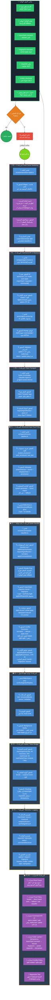

# مخطط مراجعة تنفيذ خطة إعادة هيكلة بايبلاين التصنيف

```mermaid
%% ══════════════════════════════════════════════════════════════
%% وركفلو مراجعة تنفيذ خطة إعادة هيكلة بايبلاين التصنيف
%% Command API v2 + Auto-Apply + Render-First/Review-Later
%% ══════════════════════════════════════════════════════════════

graph TD
    start(("▶ بدء المراجعة")):::startEnd

    %% ─────────────────────────────────────────
    %% المرحلة 0: Root-Cause Hardening
    %% ─────────────────────────────────────────
    subgraph P0_ROOT["🔴 P0 — المرحلة 0: Root-Cause Hardening"]
        direction TB
        p0_file["📂 فحص الملف<br/>src/extensions/line-repair.ts"]:::check
        p0_regex["🔍 التحقق: Regex / قاعدة دلالية<br/>للأفعال الوصفية بعد «ثم»"]:::check
        p0_test_block["🧪 اختبار الحالة الحرجة:<br/>«اطلع من البلد» + «ثم يخرج ورقه»<br/>لا يُدمجان كـ dialogue واحد"]:::test
        p0_merge_ok["🧪 التحقق: دمج الحوار الصحيح<br/>«...» واستكمال العطف لا يزال يعمل"]:::test
        p0_local_split["🔍 (اختياري) فحص<br/>Local Deterministic Split<br/>في paste-classifier.ts"]:::check

        p0_file --> p0_regex --> p0_test_block --> p0_merge_ok --> p0_local_split
    end

    %% ─────────────────────────────────────────
    %% المرحلة 1: Structured Input Trust Policy
    %% ─────────────────────────────────────────
    subgraph P1_TRUST["🟠 P1 — المرحلة 1: Structured Input Trust Policy"]
        direction TB
        p1_types["📂 فحص الملف<br/>src/types/structure-pipeline.ts"]:::check
        p1_levels["🔍 التحقق: تعريف مستويات الثقة<br/>trusted_structured / semi_structured / raw_text"]:::check
        p1_meta["🔍 التحقق: Metadata<br/>schemaVersion + source +<br/>integrityCheck + provenance"]:::check
        p1_rule["🔍 التحقق: القاعدة التشغيلية<br/>system-generated → Direct Import<br/>غير ذلك → fallback"]:::check
        p1_editor["📂 فحص EditorArea.ts<br/>importStructuredBlocks مُصلَح<br/>لا join + re-classify"]:::check

        p1_types --> p1_levels --> p1_meta --> p1_rule --> p1_editor
    end

    %% ─────────────────────────────────────────
    %% المرحلة 2: Command API v2 Backend
    %% ─────────────────────────────────────────
    subgraph P2_API["🔴 P0 — المرحلة 2: Command API v2 Backend"]
        direction TB
        p2_types["📂 فحص<br/>src/types/agent-review.ts<br/>حذف decisions[] القديمة"]:::check
        p2_contract["🔍 التحقق: عقد v2<br/>apiVersion: 2.0 / mode: auto-apply<br/>importOpId / requestId / commands[]"]:::check
        p2_cmds["🔍 التحقق: تعريف الأوامر<br/>relabel + split<br/>SplitCommand يحتوي splitAt UTF-16"]:::check
        p2_server["📂 فحص<br/>server/agent-review.mjs<br/>v1 محذوف بالكامل"]:::check
        p2_prompt["🔍 التحقق: Prompt الوكيل<br/>JSON فقط / commands[] / بدون leftText"]:::check
        p2_validation["🔍 التحقق: Validation السيرفر<br/>splitAt >= 0 / رفض malformed<br/>status = partial عند إسقاط"]:::check

        p2_types --> p2_contract --> p2_cmds --> p2_server --> p2_prompt --> p2_validation
    end

    %% ─────────────────────────────────────────
    %% المرحلة 3: Client Transport
    %% ─────────────────────────────────────────
    subgraph P3_CLIENT["🔴 P0 — المرحلة 3: Client Transport"]
        direction TB
        p3_file["📂 فحص الملف<br/>Arabic-Screenplay-Classifier-Agent.ts<br/>أو agent-review-client.ts"]:::check
        p3_role["🔍 التحقق: الملف هو<br/>Client Transport فقط<br/>لا منطق وكيل حقيقي"]:::check
        p3_funcs["🔍 التحقق: الدوال المتبقية<br/>requestAgentReview / parse v2<br/>أخطاء شبكة / timeout"]:::check

        p3_file --> p3_role --> p3_funcs
    end

    %% ─────────────────────────────────────────
    %% المرحلة 4: إعادة هيكلة paste-classifier
    %% ─────────────────────────────────────────
    subgraph P4_CLASSIFIER["🟠 P1 — المرحلة 4: إعادة هيكلة paste-classifier"]
        direction TB
        p4_file["📂 فحص<br/>src/extensions/paste-classifier.ts"]:::check
        p4_separation["🔍 التحقق: فصل المسؤوليات<br/>classifyLocal / buildSuspicionPacket<br/>requestAgentReview / normalize<br/>applyCommandsAuto"]:::check
        p4_render["🔍 التحقق: Render-First<br/>التصنيف المحلي فوري<br/>المراجعة غير حاجزة<br/>فشل الوكيل لا rollback"]:::check
        p4_opid["🔍 التحقق: importOpId<br/>snapshot: itemId + fingerprint<br/>+ type + rawTextLength<br/>appliedRequestIds محفوظ"]:::check
        p4_stale["🔍 التحقق: سياسات<br/>stale discard / partial apply<br/>idempotent discard<br/>لا re-anchor"]:::check
        p4_conflict["🔍 التحقق: Conflict Resolution<br/>normalize → dedupe → apply once<br/>split أولوية على relabel<br/>split+split = رفض"]:::check
        p4_apply["🔍 التحقق: تطبيق الأوامر<br/>applyRelabelCommand<br/>applySplitCommand بـ UTF-16<br/>التحقق الصامت: itemId / fingerprint / bounds"]:::check

        p4_file --> p4_separation --> p4_render --> p4_opid --> p4_stale --> p4_conflict --> p4_apply
    end

    %% ─────────────────────────────────────────
    %% المرحلة 5: توحيد نقطة الدخول
    %% ─────────────────────────────────────────
    subgraph P5_ENTRY["🟠 P1 — المرحلة 5: توحيد نقطة الدخول"]
        direction TB
        p5_func["📂 فحص EditorArea.ts<br/>وجود runTextIngestionPipeline"]:::check
        p5_inputs["🔍 التحقق: المدخلات<br/>text / structuredBlocks<br/>source / metadata"]:::check
        p5_routing["🔍 التحقق: التوجيه<br/>بناءً على Trust Level"]:::check
        p5_bg["🔍 التحقق: Background Sanity<br/>حتى trusted → فحص خلفي<br/>Auto-Apply عند الرجوع"]:::check

        p5_func --> p5_inputs --> p5_routing --> p5_bg
    end

    %% ─────────────────────────────────────────
    %% المرحلة 6: Packet / Token Budget
    %% ─────────────────────────────────────────
    subgraph P6_BUDGET["🟡 P2 — المرحلة 6: Packet / Token Budget"]
        direction TB
        p6_limits["🔍 التحقق: الحدود المثبتة<br/>maxSuspiciousLines: 40<br/>maxChars: 240 / maxForced: 20<br/>maxPacketChars / timeout / retry"]:::check
        p6_priority["🔍 التحقق: أولوية العناصر<br/>forced → suspicion score → طول"]:::check
        p6_chunk["🔍 التحقق: Chunking<br/>(إن مفعّل) importOpId مشترك<br/>requestId مختلف / idempotency"]:::check

        p6_limits --> p6_priority --> p6_chunk
    end

    %% ─────────────────────────────────────────
    %% المرحلة 7: Telemetry
    %% ─────────────────────────────────────────
    subgraph P7_TELEMETRY["🟡 P2 — المرحلة 7: Telemetry / Logging"]
        direction TB
        p7_import["🔍 تيليمتري الإدخال<br/>importOpId / source / trustLevel<br/>suspiciousCount / sentToAgentCount"]:::check
        p7_agent["🔍 تيليمتري الوكيل<br/>requestId / latencyMs<br/>status / commandsReceived"]:::check
        p7_apply["🔍 تيليمتري التطبيق<br/>applied / skipped / fingerprint<br/>missing / invalid / conflict<br/>stale / idempotent"]:::check

        p7_import --> p7_agent --> p7_apply
    end

    %% ─────────────────────────────────────────
    %% المرحلة 8: الاختبارات
    %% ─────────────────────────────────────────
    subgraph P8_TESTS["🟠 P1-P2 — المرحلة 8: الاختبارات"]
        direction TB
        p8_root["🧪 اختبارات Root Cause<br/>منع دمج «ثم + فعل»<br/>دمج الحوار الصحيح يعمل"]:::test
        p8_trust["🧪 اختبارات Trust Policy<br/>trusted → direct import<br/>semi → fallback / raw → classifier"]:::test
        p8_v2["🧪 اختبارات Command API v2<br/>parse relabel / split<br/>رفض malformed / splitAt UTF-16"]:::test
        p8_stale["🧪 اختبارات stale / partial / idempotency<br/>importOpId mismatch → discard<br/>fingerprint → partial<br/>requestId → idempotent"]:::test
        p8_conflict["🧪 اختبارات Conflict Policy<br/>split+relabel / split+split"]:::test
        p8_regression["🧪 Regression Test<br/>الجملة المختلطة لا تنتهي<br/>كـ dialogue واحدة"]:::test

        p8_root --> p8_trust --> p8_v2 --> p8_stale --> p8_conflict --> p8_regression
    end

    %% ─────────────────────────────────────────
    %% معايير القبول النهائية
    %% ─────────────────────────────────────────
    subgraph FINAL["✅ معايير القبول النهائية"]
        direction TB
        f1["✅ الإدراج يظهر فوراً<br/>بدون انتظار الوكيل"]:::accept
        f2["✅ فشل الوكيل لا يوقف<br/>الإدراج ولا rollback"]:::accept
        f3["✅ importOpId mismatch<br/>→ discard كامل"]:::accept
        f4["✅ fingerprint mismatch<br/>→ partial apply فقط"]:::accept
        f5["✅ requestId مكرر<br/>→ لا يُعاد تطبيقه"]:::accept
        f6["✅ trusted_structured<br/>→ لا يُعاد تحويله لنص"]:::accept
        f7["✅ حوار + «ثم فعل وصفي»<br/>→ لا تبقى مصنفة خطأ"]:::accept

        f1 --- f2 --- f3 --- f4 --- f5 --- f6 --- f7
    end

    %% ─────────────────────────────────────────
    %% القرار النهائي
    %% ─────────────────────────────────────────
    verdict{"🏁 هل كل المعايير<br/>محققة؟"}:::decision
    pass(("✅ التنفيذ مكتمل")):::pass
    fail["❌ قائمة النواقص<br/>مع أرقام المراحل"]:::fail

    %% ─────────────────────────────────────────
    %% التدفق الرئيسي
    %% ─────────────────────────────────────────
    start --> P0_ROOT
    P0_ROOT --> P2_API
    P2_API --> P3_CLIENT
    P3_CLIENT --> P1_TRUST
    P1_TRUST --> P4_CLASSIFIER
    P4_CLASSIFIER --> P5_ENTRY
    P5_ENTRY --> P6_BUDGET
    P6_BUDGET --> P7_TELEMETRY
    P7_TELEMETRY --> P8_TESTS
    P8_TESTS --> FINAL
    FINAL --> verdict
    verdict -- "نعم" --> pass
    verdict -- "لا" --> fail
    fail -- "معالجة النواقص" --> start

    %% ─────────────────────────────────────────
    %% التنسيق
    %% ─────────────────────────────────────────
    classDef startEnd fill:#7ED321,stroke:#5B9A18,color:#fff,stroke-width:3px
    classDef check fill:#4A90D9,stroke:#2C5F8A,color:#fff,stroke-width:1px
    classDef test fill:#9B59B6,stroke:#7D3F98,color:#fff,stroke-width:1px
    classDef accept fill:#2ECC71,stroke:#27AE60,color:#fff,stroke-width:1px
    classDef decision fill:#E67E22,stroke:#D35400,color:#fff,stroke-width:2px
    classDef pass fill:#27AE60,stroke:#1E8449,color:#fff,stroke-width:3px
    classDef fail fill:#E74C3C,stroke:#C0392B,color:#fff,stroke-width:2px

    %% تنسيق المجموعات الفرعية
    style P0_ROOT fill:#2C3E50,stroke:#E74C3C,color:#ECF0F1,stroke-width:2px
    style P2_API fill:#2C3E50,stroke:#E74C3C,color:#ECF0F1,stroke-width:2px
    style P3_CLIENT fill:#2C3E50,stroke:#E74C3C,color:#ECF0F1,stroke-width:2px
    style P1_TRUST fill:#2C3E50,stroke:#E67E22,color:#ECF0F1,stroke-width:2px
    style P4_CLASSIFIER fill:#2C3E50,stroke:#E67E22,color:#ECF0F1,stroke-width:2px
    style P5_ENTRY fill:#2C3E50,stroke:#E67E22,color:#ECF0F1,stroke-width:2px
    style P6_BUDGET fill:#2C3E50,stroke:#F1C40F,color:#ECF0F1,stroke-width:2px
    style P7_TELEMETRY fill:#2C3E50,stroke:#F1C40F,color:#ECF0F1,stroke-width:2px
    style P8_TESTS fill:#2C3E50,stroke:#E67E22,color:#ECF0F1,stroke-width:2px
    style FINAL fill:#1A2530,stroke:#2ECC71,color:#ECF0F1,stroke-width:2px
```
